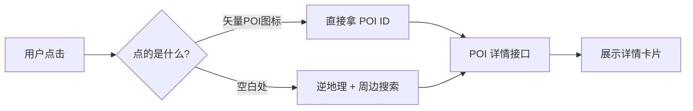

# 🔍 高德地图官方"点击 POI 显示详情"原理详解

> 关联项目：`leafletdemo01`
> 关联文件：[`src/main.js`](src/main.js)（含 `ClickPlace` 模块）
> 编写时间：2026-05-13

---

## 一、高德地图点击 POI 的本质

当你在高德官网/APP 上点击一个店铺图标（比如"星巴克"），它能精准弹出"店名 / 地址 / 电话 / 营业时间 / 评分"，背后有 **4 种核心技术** 在协作：



---

## 二、4 种实现方式对比

### ✅ 方式 1：矢量地图 POI 点击事件（高德官方核心做法）

> 这是高德官网用的方式，**最精准、最丝滑**。前提：地图必须是**矢量瓦片**（vector tile），不是图片瓦片。

**JS API 2.0 写法**：

```js
// 监听地图上 POI 图标的点击
map.on('click', (e) => {
  // poi 字段只有点到 POI 图标时才有
  if (e.poi) {
    console.log('POI ID:', e.poi.id);   // 例如 "B0FFFAB6J2"
    console.log('POI 名:', e.poi.name); // "星巴克(陆家嘴店)"
    showPoiDetail(e.poi.id);
  }
});
```

**特点**：

- 🚀 **零网络请求**就能拿到 POI ID 和名称（瓦片里已带）
- 🎯 **像素级精准**——点的就是图标本身
- ❌ **要求矢量瓦片**：本项目用的是 `webrd0X.is.autonavi.com` 栅格瓦片，**不支持**

---

### ✅ 方式 2：POI 详情接口（拿到 ID 后用）

拿到 POI ID 后，调高德 **POI 详情查询** 接口：

```
https://restapi.amap.com/v3/place/detail
  ?key=YOUR_KEY
  &id=B0FFFAB6J2
```

返回字段超丰富：

```json
{
  "name": "星巴克(陆家嘴店)",
  "type": "餐饮服务;咖啡厅;星巴克",
  "address": "陆家嘴西路168号正大广场B1层",
  "tel": "021-12345678",
  "biz_ext": {
    "rating": "4.8",
    "cost": "38",
    "open_time": "07:00-22:00"
  },
  "photos": [{ "url": "https://..." }],
  "business_area": "陆家嘴"
  // ... 30+ 字段
}
```

---

### ✅ 方式 3：栅格瓦片 → 周边搜索（本项目目前用的，可优化）

栅格瓦片拿不到 POI ID，所以高德官方在栅格地图模式下用的也是这个方案——**点击 → 周边搜索 → 找到最近 POI → 展示详情**：

```js
// 用 place/around 拿最近的 POI
const pois = await aroundLookup(lng, lat, 50);
const nearest = pois[0]; // 距离最近的
if (nearest) {
  // 用它的 id 再调 detail 接口
  const detail = await fetch(`/v3/place/detail?id=${nearest.id}&key=...`);
  showPoiDetail(detail);
}
```

**这就是项目现在做的事的"升级版"** ✨

---

### ✅ 方式 4：自渲染 POI 标记（可点击的 marker）

如果**已知一批店铺**（比如自己业务的门店），就把它们渲染成 Leaflet marker：

```js
const shops = [
  { id: 1, name: '门店A', lat: 31.23, lng: 121.50, tel: '...' },
  // ...
];

shops.forEach(shop => {
  const m = L.marker([shop.lat, shop.lng], {
    icon: L.icon({ iconUrl: '/shop.png', iconSize: [28, 28] })
  }).addTo(map);

  m.on('click', () => {
    L.popup()
      .setLatLng([shop.lat, shop.lng])
      .setContent(`<b>${shop.name}</b><br>电话: ${shop.tel}`)
      .openOn(map);
  });
});
```

**特点**：完全自主，可定制图标 / 弹窗 / 数据源，**与高德 API 无关**。

---

## 三、四种方式横向对比

| 方式 | 精准度 | 网络请求 | 信息丰富度 | 是否适用本项目 |
| --- | --- | --- | --- | --- |
| ① 矢量 POI 点击 | ⭐⭐⭐⭐⭐ | 0 | 中（需详情接口补） | ❌ 当前用栅格瓦片 |
| ② POI 详情接口 | ⭐⭐⭐⭐⭐ | 1 次 | ⭐⭐⭐⭐⭐ | ✅ 任何方式拿到 ID 后都能用 |
| ③ 周边搜索 + 详情 | ⭐⭐⭐⭐ | 1-2 次 | ⭐⭐⭐⭐ | ✅ **当前方案，可加详情** |
| ④ 自渲染 marker | ⭐⭐⭐⭐⭐ | 0 | 自定义 | ✅ 适合自己业务数据 |

---

## 四、本项目最合理的升级路径 🚀

项目现在已经实现了**方式 ③ 的前半段**（周边搜索拿 POI 列表），距离"高德官方那种详情卡"只差**一步**：

> **在 POI 列表里点某一项 → 调 POI 详情接口 → 弹出更丰富的详情卡**

### 升级方案预览

当前卡片：

```
📍 地点详情
地址: 上海市浦东新区...东方明珠
🏷 附近 POI（半径 50m）
- 东方明珠塔 风景名胜 12m   ← 现在只是文字
- 餐厅XX     餐饮       18m
```

升级后：

```
📍 地点详情
地址: 上海市浦东新区...东方明珠
🏷 附近 POI（半径 50m）
- [东方明珠塔] 12m    ← 点击展开详情 ▼
   ├─ 📞 021-58791888
   ├─ 🕐 08:00-21:30
   ├─ ⭐ 4.7（10万+评价）
   ├─ 💰 ¥220/人
   └─ 🖼 [缩略图]
- [餐厅XX]   18m
```

### 实现要点（仅需 ~30 行代码）

```js
// 1. 给每个 POI <li> 加 data-poi-id
html += `<li data-poi-id="${escapeHtml(p.id)}" class="poi-item">...</li>`;

// 2. POI 详情接口
async function poiDetail(id) {
  const url = `https://restapi.amap.com/v3/place/detail?key=${AMAP_KEY}&id=${id}`;
  const r = await fetch(url).then(r => r.json());
  return r.pois && r.pois[0];
}

// 3. 委托点击事件
card.addEventListener('click', async (ev) => {
  const li = ev.target.closest('[data-poi-id]');
  if (!li) return;
  const id = li.getAttribute('data-poi-id');
  const detail = await poiDetail(id);
  // 在 li 下面展开详情面板
  li.insertAdjacentHTML('beforeend', renderPoiDetailPanel(detail));
});
```

---

## 五、关于"矢量瓦片 + 原生 POI 点击"的可能性

如果想要高德官网那种点 POI 图标的体验，需要换底图为高德矢量瓦片。两种途径：

| 途径 | 难度 | 说明 |
| --- | --- | --- |
| 改用高德 JS API 2.0 | 🟡 中 | 但要放弃 Leaflet 框架，整体重写 |
| Leaflet + 矢量瓦片插件 | 🔴 高 | 高德矢量瓦片不公开，需用 OSM / MapTiler 等替代方案 |

> 💡 **建议**：项目栈是 Leaflet + 高德栅格瓦片，**不必折腾换矢量**——把当前方案 ③ 升级到带 POI 详情就足够好用了。体验 90%，工作量 10%。

---

## 六、可选的下一步动作

- **A. 在现有"附近 POI 列表"基础上，给每条 POI 加"点击展开详情"** ⭐ 推荐
  > 工作量小、体验大幅提升、与现有代码完美兼容
- **B. 直接把"点击地图任意点"的卡片，改成显示最近 POI 的完整详情**
  > 类似高德官网空白处点击的体验
- **C. 加一个"店铺图层"——支持业务方传入自己的店铺数据，渲染成可点击 marker**
  > 适合有自己业务数据的需求
- **D. 仅作原理参考，不动代码**
